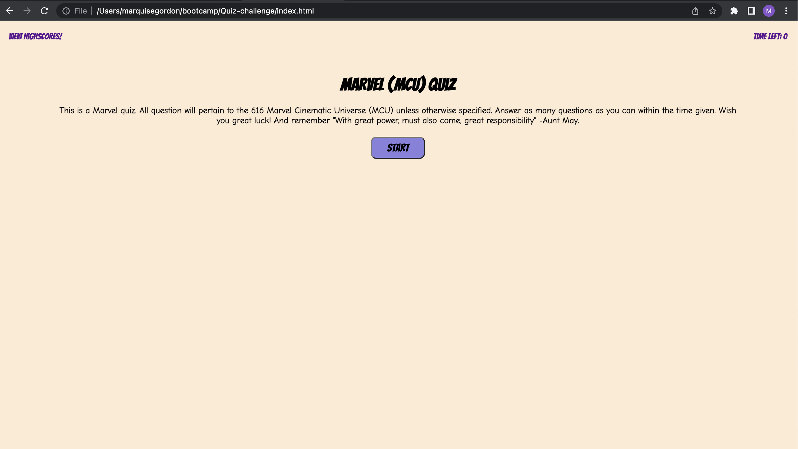
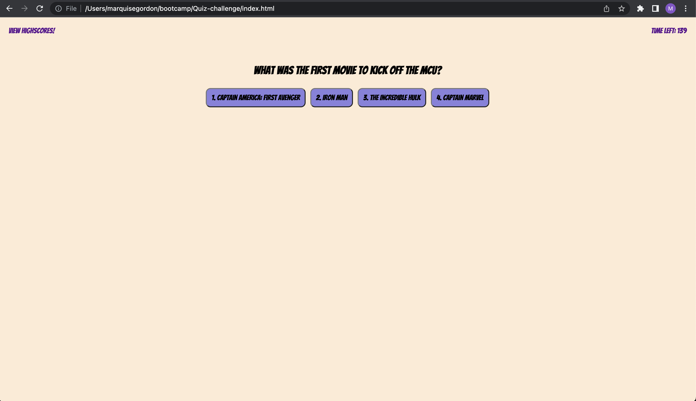
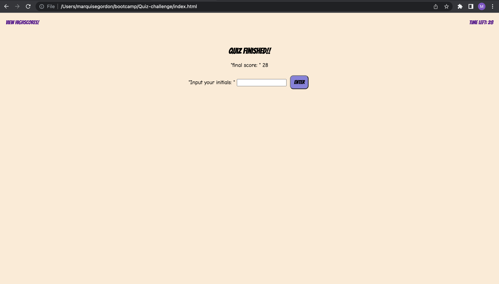

# Quiz-Challenge

## Description

Provide a short description explaining the what, why, and how of your project. Use the following questions as a guide:

- The motivation for this project was to learn how to impliment web apis to build a basic quiz.
- I build this project to better understand how to use web apis and to further my skills in build code from the ground up.
- I learned how to build a functional webpage utilizing web apis.

## Installation

What are the steps required to install your project? Provide a step-by-step description of how to get the development environment running.

## Usage

